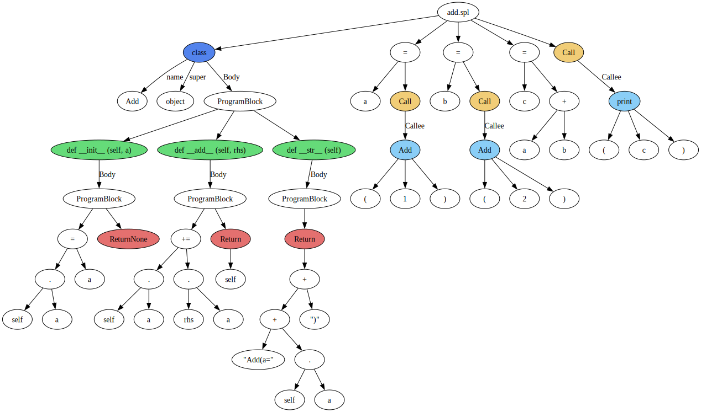

# SPL
A holistic compiler and interpreter implementation.(Educational Project)

The SPL aims to assist compiler and programming language enthusiasts in better understanding programs. It currently supports the most common syntax, drawing inspiration from the syntax designs of C/C++, Java, Python, and JavaScript.

## Tutorials

If you are interested in this programming language, here is a quick start tutorial.

-   [QuickStart](docs/mds/quickstart.md)

## Compilation and Run

-   Prerequisites
    -   JDK 17 or above.
    -   Unix-like OS preferred, but Windows also works.
    -   For Windows-only systems, using SPL through WSL (Windows Subsystem for Linux) is more convenient. Git Bash might offer an alternative.
    -   If these options don't work, configuring your own environment might be necessary.

-   Download and Installation

```bash
git clone https://github.com/Chang-LeHung/SPL
cd SPL
mvn package
chmod +x setup/install
./setup/install
```

-   Setting Environment Variables

```bash
echo "export PATH=\$PATH:~/.spl/bin" >> ~/.zshrc
echo "export PATH=\$PATH:~/.spl/bin" >> ~/.bashrc
```

-   Refreshing Environment Variables

```bash
source ~/.bashrc
or
source ~/.zshrc
```

Ensure to include `~/.spl/bin` in your `PATH` environment variable. Once those initial steps are done, you'll have full access to the capabilities of SPL.

## Visualizing your programs Using AST

SPL offers an argument that aids in visualizing a program within an Abstract Syntax Tree (AST):

```bash
spl <xxx.spl> -o xxx.dot
dot -Tsvg xxx.dot -o xxx.svg
or
dot -Tpdf xxx.dot -o xxx.pdf
```

Here's a demonstration:



