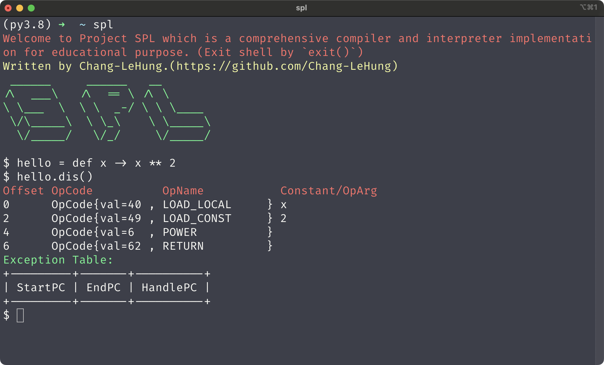
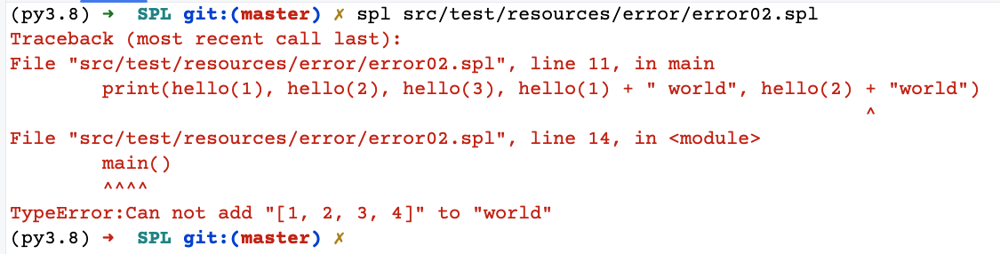
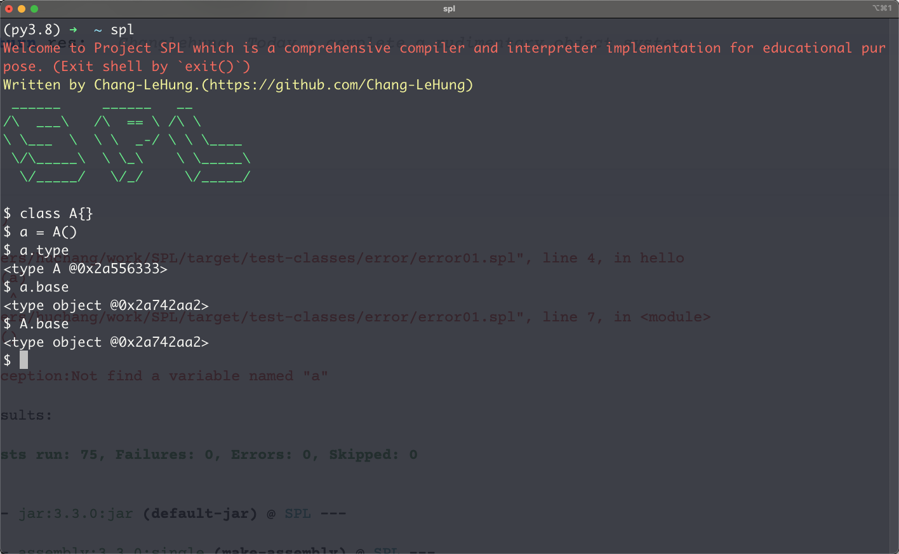
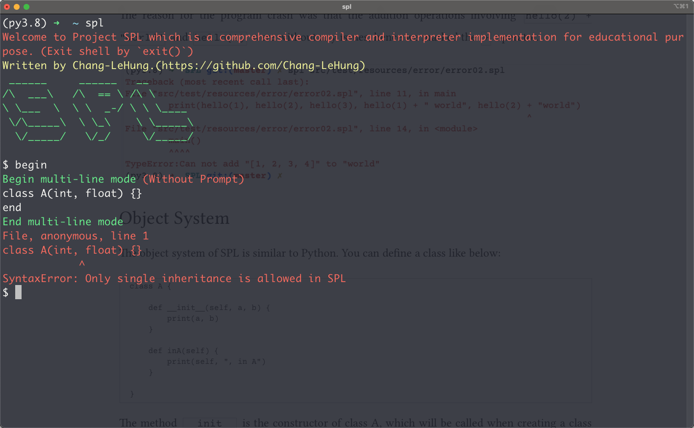

# SPL

A comprehensive compiler and interpreter implementation.(Educational Project)

The SPL aims to assist compiler and programming language enthusiasts in better understanding programs. It currently supports the most common syntax, drawing inspiration from the syntax designs of C/C++, Java, Python, and JavaScript.

## Basics

### Loops

#### While loop

```spla = 1
while (a < 10) {
    if ( a== 3) {
        a += 1
        continue
    }
    print(a)
    a += 1
    if (a == 5) {
        break
    }
}
```

#### For loop

Basic loop:

```spl
a = 1

for(;a < 10; a += 1) {
    if (a == 3)
        continue
    print(a)
    if (a > 5)
        break
}
```

Consice loop:

```spl
data = [1, 2, 3, 4, 5]

for i in data {

    print(i)
}
```

### Data Structures

dict

```spl
data = {1:2, 3:4, 5:6}

print("data = ", data)

for pair in data {
    print("key = ", pair.key, " value = ", pair.val)
    print("key = ", pair.key, " value = ", pair.value)
}
```

set 

```spl
data = {1, 2, 3, 4, 5}
print("data = ", data)
for i in data {
    print(i)
}
```

list

```spl
data = [1, 2, 3]
print(data * 3)
print(data + data)
data = [1, 2, 3]
print(data.append(4))
print(data)
```

### Functions 

Define a function and use it:

```spl
words = "******"

def hello(a, b, c, d) {
    global words
    print("Hello World")
    print(a, b, c, d)
    print(words)
}

print("Hello World")
print("===========")
hello(1, 2, 3, 4)
```

Function with default arguments:

```spl
def hello(n=5) {
    print(n)
}

hello()
hello(110)

```

SPL creates a function dynamically, so you can use an expression as the default arguments, like below:

```spl
words = "spl "
def hello(a, b, c, d, e=words*2) {
    global words
    print(words)
}
```

Anonymous functions :

```spl
name = def (x) {
    print(x)
}
name("hello")
```

```spl
name = def (x) -> x**2
print(name(2))
```

```spl
name = def x -> x**2
print(name(2))
```

Magic operations of function:

We can print the instructions (bytecodes ) of a function by calling the method `dis` of the functions in SPL:

```spl
hello = def x -> x**2
hello.dis()
```

```html
Offset OpCode          OpName           Constant/OpArg
0      OpCode{val=40 , LOAD_LOCAL     } x
2      OpCode{val=49 , LOAD_CONST     } 2
4      OpCode{val=6  , POWER          }
6      OpCode{val=62 , RETURN         }
Exception Table:
+---------+-------+----------+
| StartPC | EndPC | HandlePC |
+---------+-------+----------+
```



The instruction `LOAD_LOCAL` pushes the variable `x` into the stack and the `LOAD_CONST` pushes the constant `2` into the stack, then `POWER` pops 2 items and calculates `x**2` and pushes the result into the stack.

### Exception flow

In SPL, we implement exception flow handling with exception tables and we can print it with `dis` method as mentioned before in the function section.

```spl
def test() {
    try {
        a = 1 / 1
        return 1024
    } catch( ZeroDivisionError e) {
        print(e)
    } catch (Exception e) {
        print(e)
    }
    finally {
        print("In finally")
    }
}

res = test()
print("res = ", res)

test.dis()
```

```bash
In finally
res = 1024
Offset OpCode          OpName           Constant/OpArg 
0      OpCode{val=49 , LOAD_CONST     } 1
2      OpCode{val=49 , LOAD_CONST     } 1
4      OpCode{val=4  , DIV            }
6      OpCode{val=39 , STORE_LOCAL    } a
8      OpCode{val=49 , LOAD_CONST     } In finally
10     OpCode{val=43 , LOAD_NAME      } print
12     OpCode{val=48 , CALL           } 1
14     OpCode{val=52 , POP            }
16     OpCode{val=49 , LOAD_CONST     } 1024
18     OpCode{val=62 , RETURN         }
20     OpCode{val=69 , LONG_JUMP      } 40
24     OpCode{val=43 , LOAD_NAME      } ZeroDivisionError
26     OpCode{val=68 , EXEC_MATCH     }
28     OpCode{val=54 , JUMP_FALSE     } 14
30     OpCode{val=70 , STORE_EXC_VAL  } e
32     OpCode{val=43 , LOAD_NAME      } e
34     OpCode{val=43 , LOAD_NAME      } print
36     OpCode{val=48 , CALL           } 1
38     OpCode{val=52 , POP            }
40     OpCode{val=59 , JUMP_ABSOLUTE  } 64
44     OpCode{val=43 , LOAD_NAME      } Exception
46     OpCode{val=68 , EXEC_MATCH     }
48     OpCode{val=54 , JUMP_FALSE     } 14
50     OpCode{val=70 , STORE_EXC_VAL  } e
52     OpCode{val=43 , LOAD_NAME      } e
54     OpCode{val=43 , LOAD_NAME      } print
56     OpCode{val=48 , CALL           } 1
58     OpCode{val=52 , POP            }
60     OpCode{val=59 , JUMP_ABSOLUTE  } 64
64     OpCode{val=49 , LOAD_CONST     } In finally
66     OpCode{val=43 , LOAD_NAME      } print
68     OpCode{val=48 , CALL           } 1
70     OpCode{val=52 , POP            }
72     OpCode{val=63 , RETURN_NONE    }
Exception Table:
+---------+-------+----------+
| StartPC | EndPC | HandlePC |
+---------+-------+----------+
|    0    |  20   |    24    |
|   24    |  44   |    64    |
|   44    |  64   |    64    |
+---------+-------+----------+
```

### Better tracebacks

In SPL, we provide better traceback information than Java and Javascript. When a program crashes, SPL not only prints the call stack but also marks the location of the source error.

```spl
def hello(a) {
    if (a > 1)
        return [1, 2, 3, 4]
    return "hello"
}

def main() {
    print(hello(1), hello(2), hello(3), hello(1) + " world", hello(2) + "world")
}

main()
```

In general, the traceback is like below:

```spl
Traceback (most recent call last):
File "src/test/resources/error/error02.spl", line 11, in main
        print(hello(1), hello(2), hello(3), hello(1) + " world", hello(2) + "world")  
File "src/test/resources/error/error02.spl", line 14, in <module>
        main()
TypeError:Can not add "[1, 2, 3, 4]" to "world"
```

The result in SPL is as follows:

```spl
Traceback (most recent call last):
File "src/test/resources/error/error02.spl", line 11, in main
        print(hello(1), hello(2), hello(3), hello(1) + " world", hello(2) + "world")
                                                                          ^         
File "src/test/resources/error/error02.spl", line 14, in <module>
        main()
        ^^^^  
TypeError:Can not add "[1, 2, 3, 4]" to "world"
```

The reason for the program crash was that the addition operations involving `hello(2) + "world"` and `hello(2)` were without any issues, hence we marked the `+` operator.



### Object System

####  Basics

The object system of SPL is similar to Python. You can define a class like below:

```spl
class A {

    def __init__(self, a, b) {
        print(a, b)
    }

    def inA(self) {
        print(self, ", in A")
    }

}
```

The method `__init__` is the constructor of class A, which will be called when creating a class object.

In SPL, each object possesses a distinct attribute called `type` that indicates the object's type. Additionally, every class features a unique attribute named `base`, pointing to its base class.



#### Inheritances 

SPL follows a single inheritance model where only one superclass can be inherited. In cases where there's no explicitly defined superclass, the default one used is the `object` class. If you define a class with multiple super classes, the compiler will throw an SyntaxError during compilation.

```spl
class A(int, float) {}
```



Let's implement an example with inheritance: 

```spl
class A {

    def __init__(self, a, b) {
        print(a, b)
    }

    def inA(self) {
        print(self, ", in A")
    }
}

o = A(10, 20)

class B(A) {

    def __init__(self, a, b) {
        print(a*b)
        self.a = a
        self.b = b
    }

    def __str__(self) {
        return "a = " + self.a + ", b = " + self.b
    }
}

o = B(10, 20)
o.inA() # call the super classs's method

```

#### Static stuffs

In SPL, you can define a static attribute just like Python:

```spl
class A {

    data = "Data in A"

    def __init__(self, a, b) {
        print(a, b)
    }


    def inA(self) {
        print(self, ", in A")
    }

}
print(A.data)
```

Additional, you can define a static method use the decorator `static`:

```spl
class A {

    def __init__(self, a, b) {
        print(a, b)
    }

    def inA(self) {
        print(self, ", in A")
    }

    @static
    def staticDemo() {
        print("staticDemo")
    }
}

```

#### Object System(Data Model)

In SPL, many magic functions are specifically tied to different operators. For instance, operators like +, -, /, and * each correspond to their unique magical function within the language.

Some of the magic functions are as follows:

| Magic method    | Operator |
| --------------- | -------- |
| \_\_add\_\_     | +        |
| \_\_sub\_\_     | -        |
| \_\_mul\_\_     | *        |
| \_\_div\_\_     | /        |
| \_\_truediv\_\_ | //       |
| \_\_mod\_\_     | %        |
| \_\_power_\_    | **       |
| \_\_lshift\_\_  | <<       |
| \_\_rshift\_\_  | >>       |
| \_\_and\_\_     | &        |
| \_\_or\_\_      | \|       |
| \_\_xor\_\_     | ^        |
| \_\_neg\_\_     | -        |
| \_\_pos\_\_     | +        |
| \_\_invert\_\_  | ~        |
| \_\_lt\_\_      | <        |
| \_\_le\_\_      | <=       |
| \_\_eq\_\_      | ==       |
| \_\_ne\_\_      | !=       |
| \_\_gt\_\_      | >        |
| \_\_ge\_\_      | >=       |

This is an example to implement magic functions of specific operators:

```spl
class Add {

    def __init__(self, a) {
        self.a = a
    }

    def __add__(self, rhs) {
        self.a += rhs.a
        return self
    }


    def __str__(self) {
        return "Add(a=" + self.a + ")"
    }
}

a = Add(1)
b = Add(2)
c = a + b
print(c)

```

